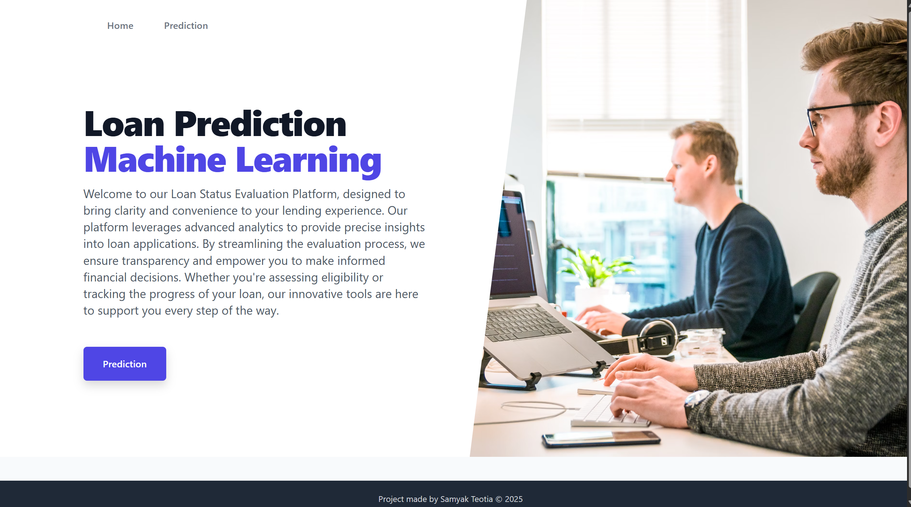
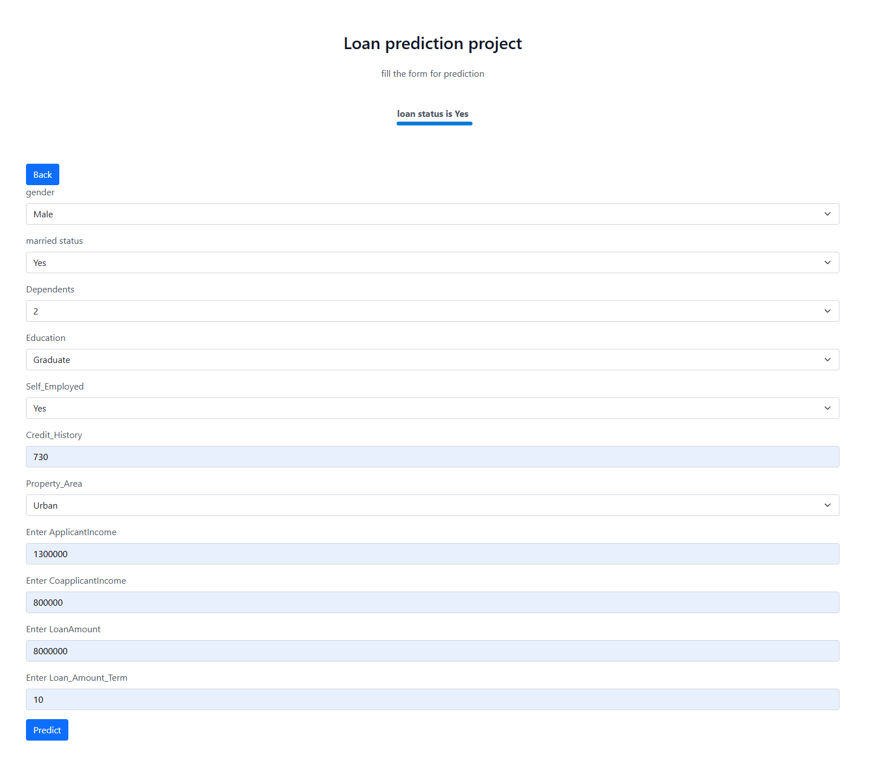

# Loan Approval Prediction

This project is a **machine learning-based web application** that predicts whether a loan application is likely to be approved or not. Built with a Flask backend and an HTML/CSS-based frontend, it offers a smooth and responsive user interface for interacting with the predictive model in real-time.

## Overview

The project leverages ensemble learning techniques and optimized logistic regression to deliver accurate and fast loan approval predictions. It is designed for easy deployment and can serve as a prototype for financial institutions or loan consultancy platforms.

## Features

- Developed a user-friendly **Flask web interface** for seamless loan application evaluation.
- Achieved **80% accuracy** and **78% precision** using ensemble models like **Random Forest** and optimized **Logistic Regression**.
- Preprocessed and engineered over **6000+ loan records**, improving data quality and reducing noise by **35%**.
- **Reduced inference time by 40%**, achieving real-time predictions with **average response times under 200ms**.
- Built an intuitive frontend using **HTML** and **CSS** for ease of interaction.

## Machine Learning Models

- **Random Forest Classifier**
- **Logistic Regression** (with hyperparameter tuning)

**Evaluation Metrics:**
- Accuracy: 80%
- Precision: 78%

## Dataset

- Contains 6000+ real-world loan records with features such as:
  - Applicant income
  - Credit history
  - Loan amount
  - Employment status
  - Marital status

**Preprocessing Steps:**
- Missing value imputation
- Feature encoding and transformation
- Outlier handling
- Dimensionality reduction and noise reduction

## Tech Stack

- **Backend**: Flask (Python)
- **Frontend**: HTML, CSS
- **ML Libraries**: scikit-learn, pandas, NumPy

## Home Page

## Form 

